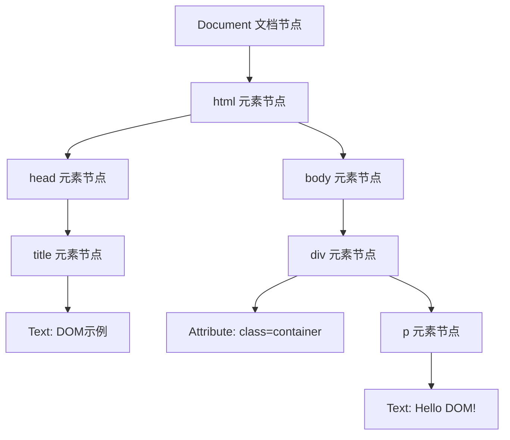
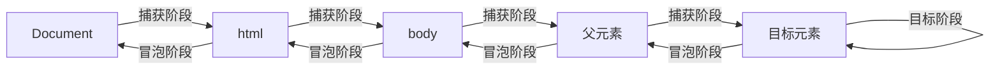

# 浏览器中的DOM详解

# 一、DOM概述

## 1.1 什么是DOM

DOM，即文档对象模型（Document Object Model），是W3C（万维网联盟）定义的一套标准接口，用于表示和操作HTML、XML等文档的结构。简单来说，DOM将网页文档转化为一个可被编程语言（如JavaScript）访问和操作的树形结构，使得开发者能够动态修改文档的内容、结构和样式。

需要明确的是，DOM并非编程语言，而是一套接口规范。浏览器会根据DOM标准解析HTML文档，构建出对应的DOM树，再通过JavaScript等脚本语言调用DOM接口来操作文档。

## 1.2 DOM的核心作用

- **结构映射**：将HTML/XML文档的标签、属性、文本等元素映射为树形结构中的节点，清晰呈现文档的层级关系。

- **交互桥梁**：为脚本语言提供访问和操作文档的入口，实现网页的动态交互（如修改文本内容、添加删除元素、响应事件等）。

- **跨语言兼容**：DOM接口独立于具体编程语言，无论是JavaScript、Python还是Java等，都可通过对应的绑定来使用DOM。

## 1.3 DOM与HTML的关系

HTML是用于编写网页结构的标记语言，而DOM是浏览器对HTML文档的解析结果。当浏览器加载HTML页面时，会经历以下过程：

1. 浏览器下载HTML文档内容；

2. 解析器解析HTML标签，构建DOM树；

3. 同时解析CSS，构建CSSOM（CSS对象模型）；

4. 将DOM树与CSSOM结合，生成渲染树（Render Tree）；

5. 根据渲染树绘制页面，最终呈现给用户。

需要注意的是，DOM树并非与HTML源码完全一致，浏览器会自动修正不规范的HTML语法（如缺失的闭合标签）后再构建DOM树。

# 二、DOM的核心结构——节点树

## 2.1 节点的概念

DOM树的基本组成单位是节点（Node），HTML文档中的每个部分都对应一个节点，常见的节点类型包括：


## 2.2 DOM树的层级关系

DOM树以文档节点（Document）为根，所有其他节点都是其后代节点，呈现清晰的层级结构，常用的亲属关系术语包括：

- **父节点（Parent Node）**：每个节点（除根节点外）有且只有一个父节点，直接包含该节点的节点。

- **子节点（Child Node）**：一个节点可以有多个子节点，直接被该节点包含的节点。

- **兄弟节点（Sibling Node）**：拥有相同父节点的节点互为兄弟节点。

- **祖先节点（Ancestor Node）**：从父节点到根节点的所有节点。

- **后代节点（Descendant Node）**：一个节点的所有子节点、孙节点等。

### 示例：HTML结构对应的DOM树

以下HTML代码：

```html

<!DOCTYPE html>
<html>
  <head>
    <title>DOM示例</title>
  </head>
  <body>
    <div class="container">
      <p>Hello DOM!</p>
    </div>
  </body>
</html>
```

对应的DOM树结构为：


# 三、DOM的核心操作

DOM操作是前端开发的核心技能之一，主要包括节点的查找、创建、修改、删除和事件绑定等，以下是常用的操作方法（基于JavaScript）。

## 3.1 节点查找

通过Document对象提供的方法查找指定节点，返回对应的元素节点或节点集合：

|方法|描述|示例|
|---|---|---|
|getElementById()|根据元素id查找，返回唯一的元素节点（id需唯一）|const box = document.getElementById('box');|
|getElementsByClassName()|根据类名查找，返回HTMLCollection（类数组）|const items = document.getElementsByClassName('item');|
|getElementsByTagName()|根据标签名查找，返回HTMLCollection（类数组）|const paras = document.getElementsByTagName('p');|
|querySelector()|根据CSS选择器查找，返回第一个匹配的元素节点|const firstItem = document.querySelector('.item');|
|querySelectorAll()|根据CSS选择器查找，返回NodeList（类数组，支持forEach）|const allItems = document.querySelectorAll('.item');|
HTMLCollection与NodeList的区别：HTMLCollection是动态集合，文档变化时会自动更新；NodeList是静态集合，文档变化时不会更新（querySelectorAll返回的是静态NodeList）。

## 3.2 节点创建与插入

创建新节点并插入到DOM树中，实现页面内容的动态添加：

|方法|描述|示例|
|---|---|---|
|createElement(tagName)|创建指定标签的元素节点|const newDiv = document.createElement('div');|
|createTextNode(text)|创建文本节点|const textNode = document.createTextNode('新文本');|
|appendChild(child)|将子节点添加到父节点的末尾，返回子节点|newDiv.appendChild(textNode);|
|insertBefore(newNode, refNode)|在参考节点前插入新节点，返回新节点|document.body.insertBefore(newDiv, document.getElementById('oldDiv'));|
|append(...nodes)|添加多个节点/文本到父节点末尾，支持字符串（自动转文本节点）|newDiv.append('文本', anotherNode);|
## 3.3 节点修改

修改已存在节点的内容、属性或样式：

### 3.3.1 内容修改

- **innerHTML**：设置或获取元素内的HTML内容（包含标签），存在XSS风险。

- **textContent**：设置或获取元素内的纯文本内容（忽略标签），更安全。

- **outerHTML**：设置或获取元素及其内容的HTML（包含自身标签）。

示例：

```javascript

const div = document.getElementById('box');
div.innerHTML = '<p>修改后的HTML内容</p>'; // 会解析HTML标签
div.textContent = '<p>修改后的文本内容</p>'; // 直接显示字符串，不解析标签
```

### 3.3.2 属性修改

- **setAttribute(name, value)**：设置元素的指定属性。

- **getAttribute(name)**：获取元素的指定属性值。

- **removeAttribute(name)**：删除元素的指定属性。

- **直接操作属性**：对于常用属性（如src、href、id），可直接通过元素对象的属性访问。

示例：

```javascript

const img = document.querySelector('img');
img.setAttribute('src', 'new-img.jpg'); // 设置src属性
console.log(img.getAttribute('alt')); // 获取alt属性值
img.removeAttribute('title'); // 删除title属性
img.id = 'new-img-id'; // 直接修改id属性
```

### 3.3.3 样式修改

通过**style**属性修改元素的内联样式，或通过**classList**操作CSS类：

```javascript

const div = document.getElementById('box');
// 1. 直接修改style属性（驼峰命名，如backgroundColor对应CSS的background-color）
div.style.width = '200px';
div.style.backgroundColor = 'red';

// 2. 通过classList操作CSS类（推荐，避免内联样式冗余）
div.classList.add('active'); // 添加类
div.classList.remove('old-class'); // 删除类
div.classList.toggle('hidden'); // 切换类（存在则删除，不存在则添加）
div.classList.contains('active'); // 判断是否包含类（返回布尔值）
```

## 3.4 节点删除

从DOM树中删除指定节点，常用方法：

- **removeChild(child)**：通过父节点删除子节点，返回被删除的节点。

- **remove()**：节点自身直接删除（IE不兼容，需兼容时用removeChild）。

示例：

```javascript

const parent = document.getElementById('parent');
const child = document.getElementById('child');
// 方法1：通过父节点删除
parent.removeChild(child);
// 方法2：自身删除（现代浏览器支持）
child.remove();
```

## 3.5 事件绑定

为DOM元素绑定事件（如点击、鼠标移动等），实现交互逻辑，常用方式：

### 3.5.1 内联事件（不推荐）

直接在HTML标签中写事件处理函数，耦合度高，不易维护。

```html

<button onclick="alert('点击了')">点击我</button>
```

### 3.5.2 DOM0级事件绑定

通过元素对象的事件属性绑定，一个事件只能绑定一个处理函数（重复绑定会覆盖）。

```javascript

const btn = document.getElementById('btn');
btn.onclick = function() {
  alert('DOM0级事件触发');
};
```

### 3.5.3 DOM2级事件绑定

通过**addEventListener()**绑定，支持多个事件处理函数，可指定事件捕获/冒泡阶段，兼容性更好（IE8及以下用attachEvent）。

```javascript

const btn = document.getElementById('btn');
// 语法：addEventListener(事件名, 处理函数, 捕获/冒泡标志)
btn.addEventListener('click', function() {
  alert('DOM2级事件1触发');
}, false); // false表示冒泡阶段触发（默认）

btn.addEventListener('click', function() {
  alert('DOM2级事件2触发');
}, false); // 多个处理函数会依次执行

// 移除事件（需使用命名函数，匿名函数无法移除）
function handleClick() {
  alert('可移除的事件');
}
btn.addEventListener('click', handleClick);
btn.removeEventListener('click', handleClick);
```

# 四、DOM的事件流

## 4.1 事件流的三个阶段

当DOM元素触发事件时，事件会按照特定的顺序传播，即事件流，分为三个阶段（W3C标准）：

1. **事件捕获阶段**：事件从根节点（Document）向下传播到目标元素的父节点。

2. **目标阶段**：事件到达目标元素，触发目标元素的事件处理函数。

3. **事件冒泡阶段**：事件从目标元素的父节点向上传播回根节点。


## 4.2 事件委托

基于事件冒泡机制的优化技巧，将子元素的事件委托给父元素处理，适用于动态添加的子元素或大量子元素的场景，减少事件绑定次数，提升性能。

示例：为动态添加的列表项绑定点击事件

```javascript

// 父元素（静态存在的元素）
const ul = document.getElementById('list');

// 委托事件给父元素
ul.addEventListener('click', function(e) {
  // e.target 是触发事件的目标元素（子元素）
  if (e.target.tagName === 'LI') {
    alert('点击了列表项：' + e.target.textContent);
  }
});

// 动态添加子元素
const li = document.createElement('li');
li.textContent = '动态列表项';
ul.appendChild(li); // 新增的li无需单独绑定事件，可直接触发点击
```

# 五、DOM的常见问题与优化

## 5.1 回流与重绘

### 5.1.1 概念

- **回流（Reflow）**：当DOM元素的布局（如宽高、位置、数量）发生变化时，浏览器需要重新计算元素的位置和大小，更新渲染树，这个过程称为回流。回流成本较高，会影响页面性能。

- **重绘（Repaint）**：当元素的样式（如颜色、背景色）发生变化，但不影响布局时，浏览器只需重新绘制元素的外观，这个过程称为重绘。重绘成本低于回流。

### 5.1.2 优化技巧

- **减少回流次数**：避免频繁修改元素的样式和布局，可先将元素脱离DOM树（如隐藏元素、使用文档片段DocumentFragment），修改完成后再重新插入。

- **批量修改样式**：通过classList一次性添加多个样式，而非逐个修改style属性。

- **避免读取布局属性后立即修改**：读取offsetWidth、clientHeight等布局属性会触发回流，若后续立即修改样式，会导致连续回流，可先缓存属性值再批量修改。

- **使用CSS硬件加速**：将元素的transform、opacity等属性设置为动画，利用GPU加速，避免回流（注意过度使用可能导致性能问题）。

## 5.2 内存泄漏

DOM操作不当可能导致内存泄漏，常见场景及解决方法：

- **事件绑定未移除**：删除元素前未移除绑定的事件，导致元素无法被垃圾回收。解决：删除元素前通过removeEventListener移除事件。

- **闭包引用DOM**：闭包中引用了DOM元素，导致元素即使脱离DOM树也无法被回收。解决：在闭包执行完成后手动解除引用（如将DOM变量设为null）。

- **全局变量引用DOM**：意外创建的全局变量引用DOM元素，导致无法回收。解决：使用严格模式（'use strict'），避免意外全局变量。

# 六、总结

DOM作为浏览器解析HTML文档后的核心结构，是前端动态交互的基础。掌握DOM的节点树结构、常用操作方法（查找、创建、修改、删除、事件绑定）及优化技巧（减少回流重绘、避免内存泄漏），是前端开发者的必备技能。

在实际开发中，随着框架（如Vue、React）的普及，开发者直接操作DOM的场景逐渐减少，但框架底层依然依赖DOM操作。理解DOM的核心原理，有助于更好地使用框架，排查框架封装下的DOM相关问题。
> （注：文档部分内容可能由 AI 生成）